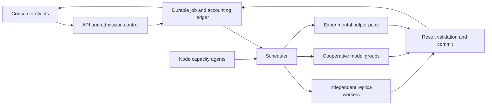

# Scheduler architecture draft

[Overview](../README.md) · [Vision](../vision.md) · [Evidence and acceptance plan](../../hackmit-prep/docs/validation.md)

This document specifies intended behavior. None of the interfaces or guarantees below is implemented yet.

## 1. System boundary

For the hackathon, one coordinator owns admission and authoritative result commits. Worker connections should be authenticated and encrypted. Outbound worker connections allow a deployment that does not assume inbound reachability through venue Wi-Fi or home NAT.

Worker-to-worker traffic is needed only by modes that actually cooperate on inference. A brokered independent worker is still part of the distributed service. A fully peer-to-peer discovery, consensus, or payment network is out of scope for the initial demonstration.

## 1a. Web gateway and deployment

The coordinator is a web gateway. Four routes:

- `GET /join`: QR code, multiplier math, and the one line installer.
- `POST /jobs` plus `GET /jobs/{id}`: submission and per job status for consumers.
- `GET /stats`: per node tasks, goodput, queue delay, and base versus bonus earnings.
- `GET /health`: readiness, attempt states, and pool capacity for debugging.

Two deployment channels ship the same worker bundle:

1. Team fleet: 5 laptops over Tailscale. This MacBook runs the coordinator plus one 7B replica. Two teammate Macs plus two headless Arch laptops join as replicas. Deploy with `git pull` plus a setup script that installs a systemd unit on Arch and a LaunchAgent on macOS. Prebuilt `llama-server` binaries are Metal on Mac and CUDA on Arch. No Docker for workers because it breaks Mac GPU passthrough and slows Arch CUDA setup.
2. Open joiners: any hacker or judge opens `/join` on the public gateway URL, exposed through a Cloudflare Tunnel so workers only dial out. One liner installs the worker:

`curl -fsSL https://<tunnel>/join.sh | sh -s -- --token ONE_TIME_TOKEN`

The installer detects `mac-arm64` versus `linux-x64`, fetches the matching `llama-server` plus a single file worker agent, verifies sha256, downloads Qwen2.5-Coder-7B Q4 if missing, benchmarks the laptop, and dials back over authenticated TLS. Default role is a 7B replica. Strong stable machines may be offered a pipeline shard. Serve the GGUF from the coordinator over LAN so joiners do not all pull 4.7 GB from Hugging Face over venue WiFi. The worker agent runs with `uv` for fast iteration.

## 2. Node capacity protocol

A node advertises a time-limited offer, not a permanent hardware rating:

| Field group | Examples |
|---|---|
| Identity and permissions | Node/session ID, authenticated owner, consent state, allowed task classes. |
| Model readiness | Artifact hash, tokenizer/template identity, quantization, runtime/backend, loaded versus downloading/warming. |
| Resource envelope | Usable memory, context/KV budget, concurrency ceiling, owner-selected CPU/GPU limits. |
| Measured service | Prefill time, decode rate at tested batch sizes, sustained rather than burst performance. |
| Connectivity | Measured latency/bandwidth to coordinator or eligible peers, recent disconnects. |
| Availability | Lease expiry, AC/battery state, memory pressure, foreground contention, drain/pause state. |

Never assume all platforms expose the same thermal or activity signals. Missing telemetry must produce conservative behavior, not fabricated measurements. Idle detection should avoid collecting keystroke content, screenshots, or private application data.

The owner can reclaim resources. Stopping generation is different from releasing model weights and KV memory. Both responsiveness and actual memory reclamation need tests.

### Serving slots, not raw machine totals

A schedulable slot is a ready replica or compatible cooperative group with a measured service envelope. Group admission requires the required model components and supported communication path to be ready.

Health checks are insufficient. A reachable process may be busy or sleeping. Two scheduler decisions can also race after observing the same free slot, so placement needs a worker-confirmed reservation with expiry and an attempt identifier.

## 3. Consumer contract

Proposed interfaces:

- `POST /jobs`: submit bounded work with a consumer-scoped idempotency key.
- `GET /jobs/{id}`: status and available result metadata.
- `GET /jobs/{id}/events`: optional progress/output stream with explicit event offsets.
- `POST /jobs/{id}/cancel`: request cancellation and report its effective outcome.

These are design sketches, not runnable endpoints. An OpenAI-compatible adapter can be added for supported inference requests, without promising every API feature.

Acceptance occurs only after durable admission. The same key and equivalent payload resolve to the same logical job; reuse with a conflicting payload is rejected. Queue caps, request size, model compatibility, token budgets, and consumer limits are checked before admission.

Each job fixes its requested model/task class, context/output limits, service class, and price policy. Do not silently downgrade the model or change price midway through an answer.

### Job and attempt state

Logical job states are queued, running, succeeded, failed, cancelled, and expired. Reservations and retries belong to separately identified attempts under that job.

- A worker receives a bounded reservation and execution lease.
- A retry gets a new attempt ID and an authoritative version/fence.
- A timeout means suspected failure, not proof that the original stopped.
- One result wins an atomic commit. Stale and duplicate completions cannot overwrite it.
- Cancellation and completion races have a documented winner in the ledger.

Execution can occur more than once. Do not promise exactly-once execution. The intended invariant is one authoritative committed result, with one settlement intent. External settlement still needs idempotent delivery or reconciliation.

For streams, the gateway owns which attempt and offsets are authoritative. After failure, replaying context or rebuilding caches can cause a pause. Never interleave an old attempt with its replacement or claim seamless continuation without proving it.

## 4. Scheduling policy

### Step A: eligibility

Reject placements that violate model/backend compatibility, memory/context limits, consent, readiness, connectivity, or group-completeness requirements.

### Step B: estimated completion

Among eligible slots, estimate queue delay + uncached prefill + generation + relevant transfer/setup costs. Estimates depend on request size and current concurrency, not a single permanent tokens-per-second score.

Use cache affinity only when it improves expected service. Sending everything to one warm worker can be worse than a cache miss on an available worker.

### Step C: service classes and fairness

- Interactive requests prioritize time to first token and completion targets, subject to admission limits.
- Delay-tolerant jobs exploit spare capacity and tolerate a stated waiting window.
- Tenant quotas and fair queuing prevent one consumer from occupying the pool indefinitely.
- Aging or equivalent policy prevents long jobs from starving behind short ones.

Initial implementation should use an understandable heuristic with measured inputs. Global optimality is not a requirement; explainability and reliable accounting are.

### Step D: feedback and transitions

Update estimates from observed work and lower offers as contention or pressure grows. Drain where feasible, stop new assignments, and requeue interrupted jobs under their retry budgets.

Keep model/role changes infrequent enough to amortize loading and cache costs. Use separate entry/exit thresholds and minimum residence periods rather than switching modes on each transient spike.

## 5. Parallelism modes

### Replicas and batching

Distribute independent requests across ready workers. Within a worker, batch compatible sequences if the backend supports it. Tune concurrency against latency and memory pressure. A larger batch can improve aggregate output while slowing each stream.

Hackathon primary: Qwen2.5-Coder-7B-Instruct Q4 runs whole on one laptop, so the 5 team laptops form five replicas with no per token network hop. Expected per replica footprint is about 4.7 GB weights plus 2 to 4 GB KV for 8k context. More replicas improve concurrent goodput, queue delay, and availability. They do not improve single request decode speed.

Projected throughput for 3 Mac plus 2 Arch replicas, to verify in benchmarks: single stream each gives about 190 tok/s raw and about 150 tok/s committed. Loaded with 3 to 4 concurrent streams each gives about 95 tok/s raw and about 70 to 80 tok/s committed goodput. Per request stays 15 to 50 tok/s by machine. The booth counter shows aggregate committed goodput, which clears 50 tok/s with headroom.

### Cooperative model groups

Place model components only across supported, stable connections. More aggregate memory can enable larger models. With multiple in-flight requests, pipeline utilization may improve aggregate throughput. Neither single-request speed nor useful scaling follows automatically.

Do not assume an MoE model requires experts to be on different machines. Placement can keep experts with their layers. Runtime support, model architecture, memory and measured communication costs determine the feasible arrangement.

Group failure is more expensive than losing an independent task. Redundant coverage alone is not complete recovery: cache state, active requests, compatible replicas, and sufficient remaining throughput also matter.

Hackathon cooperative targets, all Q4 through llama.cpp RPC or equivalent pipeline path: Qwen3-30B-A3B MoE needs 2 nodes minimum and 3 recommended; DeepSeek-Coder-V2-Lite 16B needs 2 nodes; Qwen2.5-Coder-32B needs 3 nodes; Llama-3.3-70B needs 4 nodes with 1 left for the coordinator. DeepSeek V3 or V4 Flash class at 600B plus needs 30 plus nodes and is vision only, not a weekend target.

### Experimental remote drafting

A small model proposes token blocks; the target evaluates them and commits only verified output. A first experiment can use compatible token mappings and greedy verification.

This needs a custom token/state interface. Ordinary chat calls do not expose all required target verification and cache rollback operations. Model and cache support must be established before claiming a working pair.

Judge usefulness by committed tokens per full draft/transfer/verification round, against target-only serving under equivalent demand. At high load, sacrificing target batching for speculation can be a regression. Disable assistance when it loses.

A remote drafter sees context. Its proposals and claimed probabilities are untrusted. Limit proposal sizes and use target-authoritative verification. Do not interpret speculative validation as proof that arbitrary final answers from independent providers are correct.

### Parallel coding tasks

Split work only across real dependency boundaries. Include planning, integration, tests, and retries in completion time. Independent patches are more tractable than several workers concurrently rewriting the same files.

Run generated code in an isolated environment without host credentials, control-plane access, or automatic merge privileges. Passing tests is evidence, not complete proof of correctness.

## 6. Reliability and overload

- A bounded queue is enforceable. Low latency under unlimited demand is not.
- If all providers leave, the service must expose waiting, expiry, or unavailability. Stronger availability requires reserved supply or an explicitly chosen fallback.
- Hedge only with a bounded spare-capacity budget. Unrestricted redundant requests can amplify overload.
- Persist acknowledged jobs before reporting acceptance. A single coordinator with durable state can recover, but is not highly available while it is down.
- Later replicated control-plane designs need leader fencing and consistency guarantees. Multiple schedulers without those mechanisms can double-allocate capacity.

## 7. Accounting and incentives

Separate consumer charges, provider compensation, and execution attempts. Define in advance how retries, cancellation, failed checks, and speculative assistance are paid. A provider doing authorized work may incur cost even if its output is not selected.

For the demo, use a disclosed fixed policy and bounded sponsor/team-funded workload. Real payout support remains an explicit decision, not an implied feature. Do not conflate credits with redeemable earnings.

Hackathon settlement: $0.20 per accepted 7B coding task from a $50 sponsor pool. At 60 to 100 accepted tasks per hour across 5 replicas the pool lasts about 3 hours and pays about $6 to $10 per laptop. The ledger shows live completed tasks times rate with per laptop totals. A $200 per month run rate at 8 idle hours per night is a projection from that live rate, not a promise of cash earnings.

Mining boost from a separate $25 bonus pool: first 10 nodes earn 2x base for 50 tasks, next 20 earn 1.5x, then base. Sustained serving adds up to 1.5x loyalty in 0.1x steps per 30 minutes. Zero dropped attempts in a rolling hour adds $0.05 per task that hour. Settle base pay and bonus pay as separate intents so every cent replays.

The business metric is revenue less provider payments, coordination, verification, retries, relaying and other costs. Supply can respond to price even if the hardware was already owned; fixed pricing is a simplifying choice, not a proof that supply is price-insensitive.

## 8. Security and privacy minimums

Provider software must have narrow permissions, an explicit opt-in, bounded resource use, authenticated tasks and revocation. No unannounced remote shell or unrestricted execution interface.

Workers can potentially inspect prompts, context and outputs they process. Encryption in transit does not hide data from the executing machine. Use public code/data for the demo, and do not claim no retention or private inference on untrusted hosts.

The consumer entrypoint needs authentication or controlled demo credentials, quotas, request limits and abuse controls. Unauthenticated worker onboarding is not the same as a safe open marketplace.
