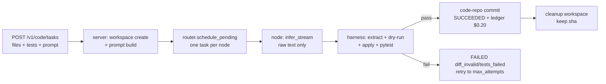

# Collaborative Optimized Code Edit — Plan (draft)

Status: draft for `justin` branch. Goal: turn raw inference nodes into a
verified direct-edit loop without trusting node output.

## 1. Invariant

Server owns canonical git. Nodes stay stateless raw inference
(`node/agent.py::_execute` + `runtime.infer_stream` unchanged in Phase 1).
A deterministic Python harness on the server extracts, applies, and
test-verifies every patch before commit and before ledger payout.

No model shell on laptops. No arbitrary consumer code on volunteer nodes.

## 2. Collaboration model (why plural nodes help)

Single-task single-node stays the default (one task per node invariant).
Collaboration is scheduler-level, not P2P:

1. **Parallel proposals (replica race, Phase 1).** Same `CodeTaskSpec` fans
   out to N nodes in different clusters. First harness-accepted patch wins
   via existing `router.on_result` first-commit-wins. Losers get `revoke`.
   This converts replica count into latency reduction and higher accept
   rate, which is the money metric ($0.20 per accepted task).
2. **Proposer plus deterministic verifier (Phase 1).** Any node proposes a
   unified diff. Server verifies with `patch --dry-run` + `test_cmd` in an
   ephemeral checkout. No LLM verifier needed. Verifier is code, not a node.
3. **Iterative session (Phase 1.5).** Follow-up fixes reuse `session_id`.
   `context_store` holds turns, `sessions.pin` gives node affinity, router
   adds `model_hint = session.cluster_key`. Migration stays rare and
   explicit via `/v1/sessions/{id}/migrate`.
4. **Sharded context (Phase 2).** Large repos pack per-model with existing
   `truncate_for_model` plus file ranking (changed files first, test files
   second, rest truncated). No inter-cluster translation in MVP.

## 3. Contracts

### 3.1 Types (`common/types.py`, additive only)

```python
class TaskType: CODE_EDIT = "code_edit"  # alongside CHAT etc.

class CodeTaskSpec(BaseModel):
    base_sha: str = ""                    # empty = fresh file dict
    files: dict[str, str]                 # path -> content, client-supplied snapshot
    allowed_paths: list[str] = []         # empty = all files writable
    test_cmd: list[str] = ["pytest", "-q"]# allowlist-enforced, list form, no shell
    timeout_s: int = 60
    patch_budget_kb: int = 100

# TaskRequest adds: code: CodeTaskSpec | None = None
# TaskResult adds: patch: str | None, test_report: dict | None, applied_sha: str | None
```

### 3.2 Patch wire format (strict)

One fenced block only, extracted by harness, everything else is comment:

````text
```diff
--- a/foo.py
+++ b/foo.py
@@ -1,2 +1,2 @@
-old
+new
```
````

Reject when: no fence, multi-fence ambiguous, absolute path, `..`,
path outside `allowed_paths`, size over budget.

### 3.3 Prompt builder (`scheduler/harness.py::build_code_prompt`)

```
system: emit one unified diff in ```diff fence. No other file writes.
user: task: <prompt>
files: <packed, truncated to context_window>
tests: <test_cmd>
base: <base_sha>
```

Reuse `context_store.truncate_for_model(session_id, window)` for packing.
Qwen2.5-Coder-7B Q4 8k budget: ~6k files+task, ~2k output reserve.

## 4. New + changed files

| File | Change | ~LOC |
|---|---|---|
| `scheduler/harness.py` (new) | `extract_diff`, `validate_diff`, `build_code_prompt` | 120 |
| `scheduler/workspaces.py` (new) | ephemeral checkout per task under `<data_dir>/workspaces/<task_id>`; `create`, `apply_patch`, `run_tests`, `commit`, `cleanup`; path + size guards | 150 |
| `scheduler/server.py` | `submit_task` branches on `CODE_EDIT` (create workspace, build prompt); `_on_agent_message RESULT` runs harness before `router.on_result` commit | 60 |
| `scheduler/vcs.py` (reuse) | second `VcsService` at `<data_dir>/code-repo`, separate from `state-repo` | 10 |
| `scheduler/router.py` | code-aware lease (`600s` when `task_type==CODE_EDIT`); score unchanged except existing length factor already prefers bigger models | 15 |
| `scheduler/api/rest.py` | `POST /v1/code/tasks`, `GET /v1/code/tasks/{id}/diff`, `GET /v1/code/tasks/{id}/tests` (thin over router views) | 60 |
| `client/sdk.py`, `client/cli.py` | `code_submit(files, test_cmd, prompt)`; `clique code-submit --prompt --test` | 70 |
| `common/protocol.py` | no version bump in Phase 1 (code rides in `TaskRequest.prompt`) | 0 |
| `node/executor.py` | no change Phase 1 (intentional) | 0 |

Total MVP ~500 lines including tests.

## 5. Execution flow



Parallel-race variant: router assigns same `task_id` family (shared
`idempotency_key` prefix) to K nodes; first `H pass` commits, rest revoked
via existing `msg_revoke`.

## 6. Verification equals payout

Accepted means all three, checked on server, never on node claim:

1. Diff parses and dry-run applies cleanly on `base_sha`.
2. Ephemeral checkout `test_cmd` exits 0 within `timeout_s`, no network,
   list-form subprocess, allowlist `pytest | cargo test | go test`.
3. Commit to `code-repo` via `VcsService.snapshot`; `applied_sha` stored
   on `TaskResult`. History never rewritten; rollback is a new commit.

Failures map to `TaskResult.error`: `diff_missing | diff_invalid |
path_forbidden | patch_conflict | tests_failed | timeout`. Retry per
`max_attempts`, then `FAILED`. Lease expiry requeues via existing
`expire_leases` + `on_node_lost`.

## 7. Scheduling + optimization notes

- Lease: `600s` for code tasks (model + test time), heartbeat unchanged.
- Scoring: reuse `Router.score` length factor; long file pack naturally
  routes to bigger `parameter_count_b`. No new ML in router.
- Idempotency: `idempotency_key` dedups resubmits; same `base_sha` +
  same prompt short-circuits repeat work.
- Streaming: `PROGRESS` deltas already flow; dash shows partial diff as
  plain text preview (no apply until terminal `RESULT`).
- Cleanup: workspace removed on terminal state; `code-repo` retains commit.
  Periodic `gc` on old workspaces in tick loop.

## 8. Security

- Input is file dict, not URL, in MVP. URL clone allowlist + op approval later.
- `test_cmd` allowlist enforced server-side; reject shell metachars.
- Never send `node.key` or bearer tokens in prompts; scrub on server.
- Op-gated: `manage_vcs` for code-repo rollback, existing `kick_node` for
  poison nodes. Poison-file reporters reuse `suggestions` channel later.

## 9. Phases

- **P0 (0.5d):** types + `extract_diff` + fixtures. Unit test only.
- **P1 (1d):** `workspaces.py` + `harness.py` + server hook + 3 REST routes
  + SDK/CLI. Integration: `test_code_patch_accepted`,
  `test_code_patch_rejected`, `test_parallel_race_first_wins`.
- **P1.5 (0.5d):** session follow-ups + dash diff preview + ledger wiring.
- **P2 (after money loop stable):** node-local loop. Move `_execute` into
  `node/executor.py`, add `node/tools.py` (`read | edit | bash` JSON fence,
  max 5 steps, `<done>` terminator). Server still reverifies. This is the
  only phase that touches node trust boundary.

Explicitly rejected: node owns canonical repo. Breaks volunteer safety
story and demo audit.

## 10. Tests

- `tests/test_harness.py` (new): fence extraction, path guards, budget cap.
- `tests/test_integration.py` (extend): accepted + rejected + race, echo
  runtime with canned diff output via stubbed `infer_stream`.
- `tests/test_extended.py` (extend): session follow-up pins cluster,
  rollback via op adds commit without rewrite.

## 11. Demo (3 min)

1. Submit broken `fizzbuzz.py` + failing test via `clique code-submit`.
2. Show queue, assign to 7B node, stream raw output in dash.
3. Show harness extracting diff, applying, tests green, commit sha.
4. Show ledger line + `vcs_history` on code-repo.

## 12. Open questions

1. Canonical code-repo per clique or per submitter? Default: one
   `code-repo` per server, namespaced dirs per submitter.
2. Binary files? MVP text only, reject NUL bytes.
3. Private-repo token flow for URL inputs? Defer to post-demo, reuse
   `CLIQUE_GITHUB_TOKEN` pattern from `join.sh`.
