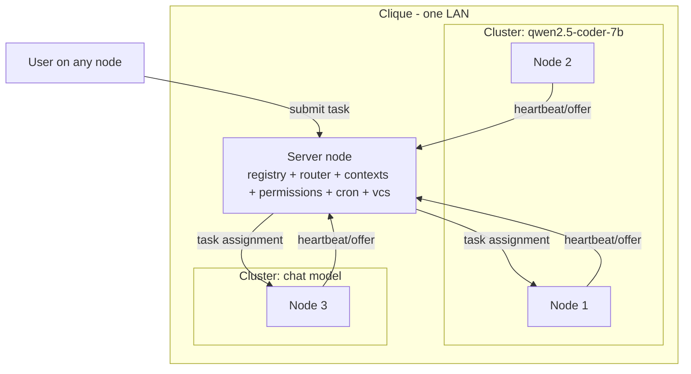

# Clique: locally shared AI models over LAN — implementation spec

[Overview](README.md)

Spec-only scaffold. Every `.py` file in this tree contains typed function/class
signatures with docstring contracts and `...` bodies. No implementation yet.

## System summary

Each device (**node**) runs an independent local model. Nodes running the same
model form a **cluster**. All nodes on the network form the **clique**. One node
is the **server node**: it holds shared contexts, the node registry, the router,
permissions, cron, and the shared versioned DB. Every other node is a
**client node**. Every node is simultaneously a dev environment (jcode-style)
and a model provider, so all nodes are both servers and clients in the
inference sense.

## File map

| Path | Responsibility |
|---|---|
| `common/types.py` | Shared dataclasses: NodeInfo, ResourceSnapshot, ModelSpec, Task, Session, Cluster, Permission levels. |
| `common/protocol.py` | Wire message schemas and (de)serialization: register, heartbeat, assign, result, context sync. |
| `common/config.py` | TOML config loading/validation for node and server roles. |
| `common/errors.py` | Error taxonomy shared by all components. |
| `node/agent.py` | Node daemon lifecycle: start, join clique, serve, drain, leave. |
| `node/discovery.py` | mDNS/zeroconf announce + browse; find or become server node. |
| `node/resources.py` | Probe CPU/GPU/memory/battery/load; produce ResourceSnapshot. |
| `node/model_runtime.py` | Adapter over llama-server/Ollama: load, unload, infer, health. |
| `node/heartbeat.py` | Periodic status/offer reporting to the server node. |
| `node/executor.py` | Accept assigned task, run on local model, stream/report result. |
| `scheduler/server.py` | Server-node entrypoint: compose registry, router, API, stores. |
| `scheduler/registry.py` | Node registry, cluster membership, liveness, op-order tracking. |
| `scheduler/router.py` | Routing policy: eligibility, load/length-aware scoring, one task per node. |
| `scheduler/context_store.py` | Shared session contexts, intra-cluster shared context. |
| `scheduler/sessions.py` | Session lifecycle, rare cross-node session migration. |
| `scheduler/permissions.py` | Op model: first client node is op, /op grant/revoke, policy modes. |
| `scheduler/cron.py` | Cron jobs requested by any node, approved by an op. |
| `scheduler/vcs.py` | Git-backed version control of the shared server DB. |
| `scheduler/suggestions.py` | Detect overloaded task types/nodes, suggest model changes. |
| `scheduler/api/rest.py` | HTTP API route specs. |
| `scheduler/api/ws.py` | WebSocket event stream specs (dashboard, session watch). |
| `client/sdk.py` | Python client for the server API (used by CLI and dashboard). |
| `client/cli.py` | Headless CLI: join, status, submit, sessions, op, cron (for GX10 etc. with no monitor). |
| `client/dashboard/README.md` | Web dashboard views and route spec. |
| `tests/README.md` | Test plan. |

## Library choices (open source unless inadequate)

| Concern              | Library                                                        | Why                                                                                                                                      | Alternatives considered                                                                                                             |
| -------------------- | -------------------------------------------------------------- | ---------------------------------------------------------------------------------------------------------------------------------------- | ----------------------------------------------------------------------------------------------------------------------------------- |
| Language/runtime     | Python 3.12 + `uv`                                             | Fast iteration.                                                                                                                  | Go (later, single-binary worker)                                                                                                    |
| LAN discovery        | `python-zeroconf` (mDNS/DNS-SD)                                | Pure-python, cross-platform, no daemon needed; standard for same-network discovery.                                                      | Avahi bindings (Linux-only), UDP broadcast (roll-your-own)                                                                          |
| Server API           | `FastAPI` + `uvicorn`                                          | Async HTTP + WebSocket in one framework, pydantic-native, OpenAPI for free.                                                              | Flask (no native WS), aiohttp (more manual)                                                                                         |
| Schemas/validation   | `pydantic` v2                                                  | Wire message validation, config validation, FastAPI integration.                                                                         | dataclasses + manual validation                                                                                                     |
| HTTP/WS client       | `httpx` + `websockets`                                         | Async, streaming responses for token streams.                                                                                            | requests (sync only)                                                                                                                |
| Resource probing     | `psutil`                                                       | CPU, memory, battery, load, per-process; cross-platform.                                                                                 | Platform-specific calls; note: GPU/VRAM needs per-platform extras (`nvidia-ml-py` on NVIDIA, `powermetrics`/IOKit parsing on macOS) |
| Model runtime        | `llama.cpp` (`llama-server`) primary; Ollama adapter secondary | GGUF, Metal + CUDA prebuilt binaries, OpenAI-compatible endpoint.                                               | vLLM (heavy for laptops), MLX (Mac-only)                                                                                            |
| Model download       | `huggingface_hub`                                              | Default model fetch (Qwen 2.5), resumable, revision pinning. Future best-model detection integrates here.                                | manual curl                                                                                                                         |
| Server DB            | `sqlite3` (stdlib), WAL mode                                   | Contexts, registry snapshots, ledger, cron defs; single-writer fits one server node.                                                     | Postgres (overkill for LAN clique)                                                                                                  |
| Shared-DB versioning | `dulwich` (pure-python git)                                    | The requested "local .git in the shared db": snapshot/commit/diff/rollback without shelling out; no adequate non-git OSS beats git here. | `pygit2` (libgit2 build pain), GitPython (subprocess-based)                                                                         |
| Cron scheduling      | `APScheduler` + `croniter`                                     | In-process cron triggers with cron-expression parsing; jobs live in our DB, approval flow is ours.                                       | system crond (no approval hook)                                                                                                     |
| CLI                  | `typer` + `rich`                                               | Headless config/dashboard alternative; `rich` tables for live status.                                                                    | argparse, click                                                                                                                     |
| Terminal dashboard   | `textual`                                                      | Full TUI dashboard for monitor-less nodes (GX10).                                                                                        | rich.live only                                                                                                                      |
| Web dashboard        | Static HTML + `htmx` (or Preact) served by FastAPI             | Zero build-step to start; upgrade path later.                                                                                            | React/Next (build overhead)                                                                                                         |
| Auth between nodes   | `PyNaCl` (libsodium) keypairs + token                          | Node identity, signed registration, op actions.                                                                                          | mTLS via self-signed CA (more setup)                                                                                                |
| Testing              | `pytest` + `pytest-asyncio`                                    | Standard.                                                                                                                                | —                                                                                                                                   |

## Implementation priority (from vision dump)

1. **P0 Connect the pool**: `node/discovery.py`, `node/agent.py`, `scheduler/registry.py`, `common/protocol.py`.
2. **P1 Basic router**: `scheduler/router.py` (longer prompts → bigger models, busyness-aware, one task per node), `node/executor.py`, `node/model_runtime.py`.
3. **P2 Dashboard/UI**: `client/cli.py`, `client/dashboard/`, `scheduler/api/*` (connect device, pick default Qwen 2.5 or bring your own model, view devices and sessions).
4. **P2 Suggestions**: `scheduler/suggestions.py` (overloaded task types → suggest a node switch models).
5. **P3 Shared context**: `scheduler/context_store.py`, `scheduler/sessions.py` (intra-cluster now, inter-cluster far future).
6. **P3 Governance/extras**: `scheduler/permissions.py` (/op, first-client-is-op), `scheduler/cron.py`, `scheduler/vcs.py`.

## Cross-cutting invariants

- One task per node at a time (router-enforced; future task decomposition relaxes this).
- Session migration between nodes in a cluster is possible via server-held context but discouraged; router treats it as a last resort.
- Missing telemetry produces conservative routing, never fabricated numbers.
- Server node is a single point of coordination; durable state + git snapshots make it recoverable, not highly available.
- Op ordering: the first client node to register is op by default; later nodes are non-op.
