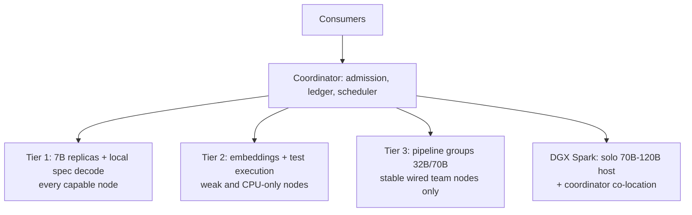

# Recommended architecture: parallelism cross-sections on heterogeneous nodes

Swarm synthesis (2 swarm rounds, 7 workers total), 2026-09-19. Question: which parallelization cross-sections (inference horizontal, embedding horizontal, model split, etc.) are viable, and what architecture is most optimized for distributed Mac/Linux consumer nodes plus one DGX Spark, with distinct per-node specs within a variance.

Evidence: [parallelism-modes.md](parallelism-modes.md) (bandwidth math), [frameworks-survey.md](frameworks-survey.md) (runtimes), [dgx-spark-hetero-scheduling.md](dgx-spark-hetero-scheduling.md) (Spark roles, scheduling), [red-fable.md](red-fable.md) (prior synthesis).

## Answer in one paragraph

Yes, parallelizing across multiple cross-sections is possible, but only three are worth building: inference horizontal (replicas), embedding horizontal (plus test execution), and pipeline sharding as a stretch tier. Tensor parallelism, sharded MoE experts, cross-node speculative decoding, and disaggregated prefill/decode are all ruled out on consumer networks by latency or missing runtime support. The optimized architecture is a role-tiered pool where the scheduler assigns each node a role from its measured envelope, not its spec sheet, and the DGX Spark serves as a solo big-model host rather than a shard in any group.

## Cross-section verdicts

| Cross-section | Verdict | Why |
|---|---|---|
| Inference horizontal (7B replica per node) | PRIMARY | Zero per-token network. Linear goodput scaling. Churn cost = 1 job retry. |
| Embedding horizontal | YES, cheapest add | Embarrassingly parallel, 0.1-1.4 GB models, absorbs weak/CPU nodes. Separate queue so filler never blocks code-task SLO. |
| Test execution / verification | YES | Self-verifying via exit codes, CPU-only nodes productive, sandbox needed anyway for the accept gate. |
| Pipeline sharding (llama.cpp RPC) | STRETCH ONLY | ~7-16 KB/token/hop, latency-bound. Viable on wired LAN or direct WireGuard <5 ms. Slowest node gates the group; whole group stalls on one loss. |
| Tensor parallel across nodes | NO | ~160 allreduce RTTs per token at 70B = 0.5-1.6 s/token from latency alone. Only exception: Thunderbolt-RDMA Mac island (exo), not our fleet. |
| MoE expert sharding | NO | All-to-all per token, worse than TP. Keep experts colocated with layers; then it is just pipeline. |
| Cross-node speculative decoding | NO | Bandwidth is cheap but no runtime exposes draft/verify/rollback over network. Local SD per replica (`llama-server --model-draft`) dominates. |
| Disaggregated prefill/decode | NO for now | KV handoff ~110-256 MB per 4k prompt erases the prefill win on 1GbE. No consumer runtime supports it. Revisit only as Spark-prefill + 10GbE island. |

## The architecture

Role assignment at join benchmark, from measured `{prefill tok/s, decode tok/s at batch, RAM, link type direct-vs-relayed, RTT, AC state}`:

- **Tier 1 (money path):** any node that decodes 7B Q4 at target rate. Slots by RAM tier (8 GB -> 2, 16 GB -> 3-4, 32 GB -> 4-6). Power-of-two-choices routing over estimated finish time. Local speculative decoding with a 0.5-1B draft to lift per-stream speed.
- **Tier 2 (filler):** nodes below 7B threshold, or idle gaps on Tier 1 nodes. Pull-based dynamic chunk queue (BOINC pattern), sampled redundant validation with cosine tolerance (never bitwise across Metal/CUDA/CPU).
- **Tier 3 (demo flex):** llama.cpp RPC pipeline for 32B/70B among 2-4 team nodes with direct WireGuard <5 ms RTT, AC power, pinned identical builds, `--tensor-split` proportional to measured speed, slow node early with fewer layers. Never admit relayed or battery nodes.
- **DGX Spark:** solo host for 70B-120B Q4 (128 GB unified memory, zero network fragility) and coordinator co-location (20-core Arm, best NIC). Its 273 GB/s bandwidth means a fast Mac beats it per-stream on decode, so never spend it on 7B replicas or embeddings. Prefill offload and speculative verification are its best future roles once a disaggregation-capable runtime exists; today solo-host is the highest-value supported role.

## Handling distinct specs within a variance

1. Never place by spec sheet. Place by measured per-(node, model, batch) envelopes from the join benchmark, refreshed by observed work (arch doc Step B/D already prescribes this).
2. Keep heterogeneity inside a tier, not inside a group. Replicas and embedding chunks tolerate any variance because work is independent and pull-based. Pipeline groups do not: keep them speed-homogeneous or size shards proportional to measured throughput.
3. Hysteresis on role changes: separate entry/exit thresholds and minimum residence, so a transient spike does not trigger a model reload.
4. Work stealing plus tail hedging absorbs 5-30% variance without static splits.

## Explicit non-goals

Tensor parallelism across nodes, sharded MoE experts, remote drafting, disaggregated prefill/decode, seamless mid-stream migration, fully P2P scheduling.

## Framework choices

Primary: `llama-server` per replica + our coordinator (only stack with Metal + CUDA + GGUF + OpenAI-compat today). Stretch: llama.cpp RPC inside Tailscale. Spark local engine: vLLM or SGLang single-node. Idea mines, not deployments: prima.cpp (heterogeneity-aware LP layer assignment), exo (discovery, topology-aware placement), GPUStack (ops patterns). Rejected: Petals (dead, 4-6 tok/s), distributed-llama (TP over Ethernet, 2^n nodes, own format).
