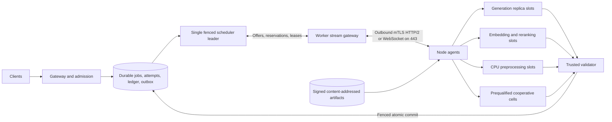

# TCJ distributed architecture research report

> Source: Apex research synthesis, September 19, 2026.

## Executive verdict

**Parallelization is feasible, but not as one uniform cluster.** The optimized design for TCJ is a heterogeneous fleet of self-describing serving cells with a centralized durable coordinator.

The key rule is: **heterogeneous globally, homogeneous locally**.

- Across the full fleet, mix Mac Metal, Linux CUDA, and CPU nodes freely through a common slot protocol.
- Inside a cooperative model-parallel cell, use only stable nodes with compatible runtimes and measured fast direct links.
- For the current five-node fleet, use whole-model request replicas first. Horizontal embedding and reranking are even better candidates because each item is independent and network payloads are small.
- Use layer or pipeline sharding only to fit a model that no node can hold. Do not expect it to accelerate a single request over ordinary Wi-Fi.
- Do not use cross-node tensor parallelism, expert parallelism, or prefill/decode disaggregation on arbitrary consumer links.

TCJ is currently a six-file design scaffold, not an implementation. `ARCHITECTURE.MD` explicitly says the interfaces are unimplemented. The component READMEs are empty, several links are stale, and every throughput figure is still a projection. The existing replica-first direction is sound, but it needs a measured protocol and benchmark harness before the projected rates become architecture inputs.

## Parallelism decision matrix

| Cross-section | Feasible? | Recommendation | Reason |
|---|---:|---|---|
| Whole-model generation replicas across independent jobs | Yes | **Build now** | No per-token network hop. Node variance is isolated. Aggregate goodput and availability scale with warmed replicas. |
| Embedding across documents or chunks | Yes | **Build now** | Stateless, idempotent, naturally batchable, and easy to redistribute after failure. Faster workers simply pull more bundles. |
| Reranking across query-candidate batches | Yes | **Build now** | Whole-model replicas and token-budgeted batches work well. Reserve capacity for online queries. |
| Chunking, tokenization, artifact transforms | Yes | **Build now** | CPU-friendly deterministic stages. Pin exact versions so chunk boundaries remain reproducible. |
| Test execution and result validation | Yes, with isolation | **Trusted lane only** | Useful for coding jobs, but generated code must not run directly on inference hosts or with credentials. |
| Layer or pipeline model sharding | Technically yes | **Capacity experiment only** | Enables larger models. Every token crosses stages, slow stages cap throughput, and a single node loss kills the group attempt. |
| Tensor parallelism | Only on a fast fabric | **Reject for ordinary LAN/WAN** | Collective communication occurs repeatedly through the model. MLX documents low-latency JACCL/RDMA as necessary for this use case. |
| MoE expert parallelism | Technically yes | **Reject initially** | All-to-all traffic, expert imbalance, and straggler sensitivity are poor matches for transient heterogeneous nodes. Keep experts with their layers. |
| Prefill/decode disaggregation | Technically yes | **Reject for consumer links** | It duplicates model weights and transfers large KV caches. DistServe gives an example needing about 90 Gbps to hide transfer for 10 requests/s on OPT-66B. |
| Remote speculative drafting | Possible | **Do not prioritize** | RTT, target verification, cache rollback, and lost target batching usually erase the gain. A local drafter is more plausible. |
| Vector database sharding across contributor laptops | Possible | **Reject** | Index durability and consistency belong on stable infrastructure. Compute vectors on contributors, then idempotently commit them centrally. |

## Recommended system shape



### Two-level scheduling

The global scheduler should not understand every backend kernel. It schedules to logical **slots**:

1. A singleton generation replica.
2. A warm embedding or reranking replica.
3. A bounded CPU preprocessing worker.
4. A cooperative group that advertises itself as one all-or-nothing slot.

The runtime inside a cooperative cell can differ:

- `llama.cpp` is the practical common GGUF baseline across Metal, CUDA, and CPU. Its RPC backend can test mixed-OS layer offload, but its own documentation calls RPC fragile, insecure, and proof-of-concept. Never expose it directly to public networks.
- Exo plus MLX is the strongest current option for a homogeneous Thunderbolt 5 Mac cell using RDMA.
- vLLM or SGLang can be used inside a stable Linux CUDA cell. Do not make their cluster assumptions the public worker protocol.
- Petals proves internet layer sharding can work, but its reported large-model rates around 4 to 6 tokens/s illustrate why it is a capacity mechanism rather than the primary fast path.

## Heterogeneous slot protocol

A schedulable offer must describe one exact service, not a generic machine score.

Minimum identity fields:

- Node session, boot ID, short-lived certificate, trust tier, and owner consent.
- Worker build, runtime backend, model artifact hash, tokenizer, chat template, quantization, and supported API features.
- OS and architecture, accelerator backend, safe RAM/VRAM or unified-memory envelope, owner limits, and shared-resource capacity group.
- AC or battery state, memory pressure, thermal state when available, foreground contention, pause/drain state, and lease expiry.
- Coordinator RTT, loss, bandwidth, direct versus relayed route, and disconnect history.

Measured service curves must be task-specific:

- Generation: prefill latency by prompt-length bucket, decode tokens/s by context and concurrency, time to first token, sustained p95 after thermal warmup.
- Embedding and reranking: tokens/s by model, input-length bucket, and batch-token budget.
- CPU work: bytes or records/s and memory high-water mark.
- Reliability: recent attempt failure, timeout, validation failure, and throttling rates.

Do not compare nodes by GPU name. A Mac unified-memory node and a discrete-VRAM Linux node can offer the same model while having very different context, batching, and thermal limits.

### Placement policy

First apply hard eligibility filters for artifact fingerprint, context, trust, memory, owner limits, service class, and connectivity. Then minimize a conservative completion estimate:

```text
p90_finish = queue_delay
           + cold_load_cost
           + predicted_prefill
           + predicted_decode_or_batch_time
           + transfer_cost
           + failure_risk_penalty
```

Use online measurements with decay, not launch-time benchmarks forever. Add tenant deficit and aging so shortest jobs do not starve long jobs.

For offline embeddings, use small pull-based bundles and work stealing. Fast nodes naturally complete more work, while slow or throttled nodes do not hold a large static partition. Bundle IDs should be deterministic from dataset, record or chunk hash, and model fingerprint.

For online work, reserve warm capacity and use strict backpressure. Batch by total tokens and compatible fingerprints, not request count. Initial values worth benchmarking are 2 to 5 ms of online batch wait and 25 to 100 ms for offline embedding accumulation.

Generation and embedding slots that share one GPU or unified-memory pool must belong to the same **capacity group**. The scheduler must not allocate both at full size. Model-role changes need hysteresis and a minimum residence time because downloads, loading, and cache loss can exceed the saved execution time.

## Control plane and durability

For the HackMIT-scale coordinator, one process with SQLite WAL is acceptable if it acknowledges work only after synchronous durable writes. PostgreSQL is the better target once API, scheduler, and validator split into services.

Core records should include:

- `jobs`: immutable consumer contract and one committed attempt pointer.
- `attempts`: attempt ID, fence generation, worker or group, deadlines, and terminal status.
- `node_sessions` and expiring `offers`.
- `artifacts` with hashes, signatures, and compatibility metadata.
- append-only `ledger_entries`.
- a transactional `outbox` for future messaging integration.

NATS JetStream is a good later transport for offline pull queues, explicit acknowledgments, and redelivery. It must not replace the authoritative SQL job and accounting state. For five nodes, direct outbound worker streams are simpler. The same protocol can later use NATS internally.

Execution is at least once. The guarantee is one authoritative committed result and one uniquely keyed settlement intent. A stale attempt may finish, but its old fence cannot commit.

## Networking and artifacts

- Public contributors connect outward over mTLS on port 443. Use bidirectional gRPC where HTTP/2 is reliable, with a WebSocket fallback for restrictive networks.
- Do not add open contributors to the team Tailscale network.
- Trusted cooperative cells may use Tailscale or a private LAN, but admit them only when the route is direct. Tailscale documents DERP and peer-relay fallbacks as slower than direct paths.
- Transfer model weights through resumable HTTPS from a CDN or venue LAN cache. Use signed manifests and content hashes. Do not move multi-gigabyte models through the control stream.
- Cooperative runtimes may use direct peer data paths only after both identity and topology checks pass.

## Reliability, security, and verification

- Use reservation TTLs, execution leases, heartbeats, attempt fences, and atomic commits.
- Do not checkpoint or migrate autoregressive KV state across heterogeneous runtimes initially. Retry the bounded generation attempt. Embedding pipelines should checkpoint every committed chunk.
- Hedge only after a measured tail threshold and only from a bounded spare-capacity budget.
- Run workers under a dedicated account. Apply Linux cgroups, namespaces, and seccomp where possible. Use native macOS resource controls. Never provide a remote shell.
- Keep generated-code tests in a separate trusted sandbox service without worker, coordinator, payout, or developer credentials.
- Open workers can read the prompts they execute. TLS does not provide confidential inference from the host. Route sensitive jobs only to trusted nodes.
- Validate coding outputs with tests plus policy checks. For embeddings, use deterministic IDs, provenance, golden-set tolerance checks, and random trusted recomputation. Sample redundancy is better than duplicating every job.
- Pin model, tokenizer, template, quantization, and runtime fingerprints. Metal and CUDA need not produce bit-identical generation even from the same weights.
- Sign the worker and artifact metadata. Plan certificate revocation, anti-Sybil controls, and payout identity before open enrollment.

## Promotion gates

These are starting gates to validate, not claims about the unmeasured fleet.

1. **Replica mode:** saturated committed goodput should reach at least 75 to 80 percent of the sum of isolated warmed-node rates. Adding a slow node must not worsen interactive p95 latency.
2. **Embedding mode:** require deterministic chunk accounting, no missing or duplicate committed IDs, and at least 75 percent parallel efficiency under a fixed corpus.
3. **Pipeline sharding:** only test on trusted AC-powered nodes with a direct path, low jitter, no relaying, identical model/runtime fingerprints, and a sustained burn-in. Promote only if the larger model is otherwise impossible or group goodput beats the best feasible single-node fallback while meeting the service target.
4. **Tensor parallelism:** require a real collective benchmark and a measured speedup of at least 1.3x after communication. Ordinary ping and link-rate claims are insufficient. In practice this means JACCL/NCCL-class RDMA, not venue Wi-Fi.
5. **Prefill/decode disaggregation:** compute KV bytes per request from the exact model and context. Require at least 2x bandwidth headroom at target arrival rate. This will likely reject consumer links.
6. **Remote speculation:** require at least 20 percent higher accepted tokens/s at equal demand with no p95 regression. Otherwise disable it.

## Recommended implementation sequence

1. **Measurement first:** freeze prompts, contexts, outputs, embedding corpus, and validator. Benchmark every real laptop for sustained service curves and network topology.
2. **Replica MVP:** native `llama-server` per node, outbound worker agent, durable jobs and attempts, fenced reservations, retries, validator, and ledger.
3. **Horizontal pipeline:** add deterministic chunking, whole-model embedding/reranking replicas, pull bundles, idempotent vector upserts, and a stable single-node Qdrant deployment if retrieval is actually needed.
4. **Public-node hardening:** signing, mTLS enrollment, revocation, trust classes, sandboxed validation, random recomputation, abuse limits, and anti-Sybil payout policy.
5. **Cooperative experiment:** compare `llama.cpp` RPC on a dedicated LAN with Exo/MLX on eligible Macs. Advertise the winning group as one slot. Do not make it a dependency of the main demo.
6. **Scale later:** PostgreSQL HA, an outbox, NATS JetStream, stateless gateway replicas, and one fenced active scheduler leader.

## Important project-specific corrections

- Current throughput and monthly earnings figures are projections. Replace them with frozen-workload measurements before public claims.
- Review the bonus-pool arithmetic and Sybil incentives before open enrollment.
- Fix the broken architecture and validation links and fill the empty component documents before implementation. Because this is a public repository, those documentation changes should go through a reviewable pull request.

## Primary sources

- [TCJ architecture draft](https://github.com/hongnoul/tcj/blob/main/ARCHITECTURE.MD)
- [llama.cpp RPC documentation](https://github.com/ggml-org/llama.cpp/tree/master/tools/rpc)
- [Exo](https://github.com/exo-explore/exo)
- [MLX distributed communication](https://ml-explore.github.io/mlx/build/html/usage/distributed.html)
- [Petals](https://github.com/bigscience-workshop/petals)
- [Text Embeddings Inference](https://github.com/huggingface/text-embeddings-inference)
- [DistServe](https://arxiv.org/abs/2401.09670)
- [Ray resource semantics](https://docs.ray.io/en/latest/ray-core/scheduling/resources.html)
- [Ray on-premises networking](https://docs.ray.io/en/latest/cluster/vms/user-guides/launching-clusters/on-premises.html)
- [NATS JetStream consumers](https://docs.nats.io/nats-concepts/jetstream/consumers)
- [Tailscale connection types](https://tailscale.com/kb/1257/connection-types)

## Quantified adversarial checks

The architecture recommendation was rechecked against explicit failure and economic calculations:

- **Cooperative-group availability compounds downward.** If each laptop is independently available with probability `p`, an all-or-nothing `n`-node group is available only `p^n`. At 95 percent per-node availability, a 2-node group is available 90.25 percent of the time, a 4-node group 81.45 percent, and a 10-node group 59.87 percent. A 4-node group needs about 98.73 percent availability per member just to reach 95 percent group availability. This supports keeping cooperative groups out of the primary reliability path.
- **The published bonus budget needs correction.** At the low stated rate of 60 accepted tasks/hour for three hours, there are 180 accepted tasks and $36 of base payouts. If the first five nodes receive a 2x early-node multiplier, the extra multiplier liability alone can reach another $36, already exceeding the separate $25 bonus pool before loyalty and the $0.05 reliability bonus. The scheduler and ledger need an explicit budget cap or prorating rule.
- **Replica claims are testable without model-parallel assumptions.** The documented loaded estimate is `3 × 25 + 2 × 10 = 95 tok/s` raw. The proposed 75 to 80 percent efficiency gate requires 71 to 76 committed tok/s, which aligns with the document's projected 70 to 80 tok/s but turns it into a falsifiable acceptance condition.
- **Tensor-parallel latency multiplies by model depth.** Even one collective per transformer layer means dozens of synchronization points per generated token. A 32-layer model with a 2 ms collective floor spends at least 64 ms/token on synchronization before useful computation, limiting the theoretical ceiling to under 16 tokens/s. This is why link-rate alone is not a promotion criterion.
- **Prefill/decode separation fails a bandwidth sanity check on consumer links.** DistServe's published example transfers about 1.13 GB of KV state for one 512-token OPT-66B request. At 10 requests/s it requires about 90 Gbps to hide transfer. A 1, 2.5, or even 10 Gbps consumer link is not in the same operating regime.
- **Runtime naming is not architecture proof.** `llama.cpp` RPC exposes remote devices, but its official documentation calls the backend proof-of-concept, fragile, and insecure. It should be benchmarked as an experimental cooperative-cell backend, not assumed to provide production pipeline scheduling or public-node security.

These checks leave the recommendation unchanged: replicas and stateless task parallelism are the production path, while cross-node model parallelism has explicit measurement and reliability gates.
